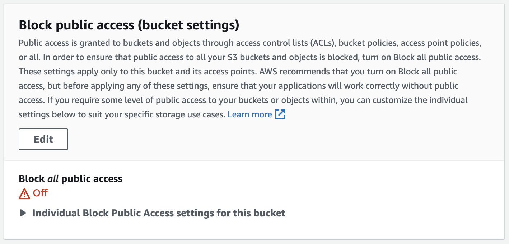

# EVAL

Everything you can do with a computer through EVAL is executable like the eval method. It can understand and generate data formats for text, image, dataframe, audio (TODO), video (TODO). It must be run inside a container that is only available to it, and it can build your container environment directly through Terminal Tools.

## Usage

1. S3 Settings
2. environments settings
3. Execute `docker-compose up -d`

### S3

1. Create a bucket.
2. Turn off the "Block all public access" setting for the bucket. 
3. Add the following text to Bucket Policy.
   ```json
   {
     "Version": "2012-10-17",
     "Statement": [
       {
         "Sid": "AllowPublicRead",
         "Effect": "Allow",
         "Principal": {
           "AWS": "*"
         },
         "Action": "s3:GetObject",
         "Resource": "arn:aws:s3:::{your-bucket-name}/*"
       }
     ]
   }
   ```

### Environment

These environmental variables are essential, so please set them.

```
BOT_NAME: your custom bot name
OPENAI_API_KEY: openai api key
AWS_ACCESS_KEY_ID
AWS_SECRET_ACCESS_KEY
AWS_REGION
AWS_S3_BUCKET
```

These environment variables are necessary to use the following tools:  
If you want to use it, set it up, and if you don't need it, you don't have to set it up.

```
SERPAPI_API_KEY: need to append google search tool
BING_SEARCH_URL, BING_SUBSCRIPTION_KEY: need to append bing search tool
```

## Tools

## TODO

- [ ] memory saving
- [ ] session manage
- [ ] convert to alpaca
- [ ] requests.get refactoring
- [ ] prompt upgrade
- [ ] give a tool to create tools
- [ ] etc.

## Reference

Thanks to the following repositories.

- https://github.com/jerryjliu/llama_index
- https://github.com/hwchase17/langchain
- https://github.com/microsoft/visual-chatgpt
